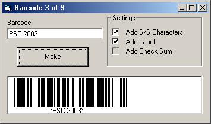



## Barcode 39 in one sub

### Description

I saw some code using a barcode font and knew i could do it with code alone. This is so simple it's one Sub only! (command1_click)
 
### More Info
 

             |
---                |---
**Submitted On**   |2003-08-31 14:13:32
**By**             |[Paul Bahlawan](https://github.com/Planet-Source-Code/PSCIndex/blob/master/ByAuthor/paul-bahlawan.md)
**Level**          |Beginner
**User Rating**    |4.7 (71 globes from 15 users)
**Compatibility**  |VB 6\.0
**Category**       |[Miscellaneous](https://github.com/Planet-Source-Code/PSCIndex/blob/master/ByCategory/miscellaneous__1-1.md)
**World**          |[Visual Basic](https://github.com/Planet-Source-Code/PSCIndex/blob/master/ByWorld/visual-basic.md)
**Archive File**   |[Barcode\_39163904912003\.zip](https://github.com/Planet-Source-Code/paul-bahlawan-barcode-39-in-one-sub__1-48149/archive/master.zip)

